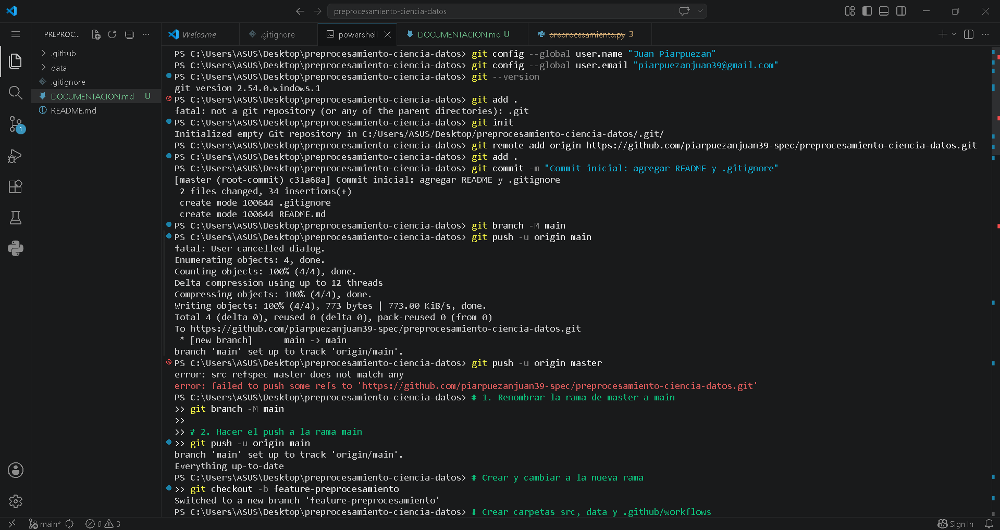
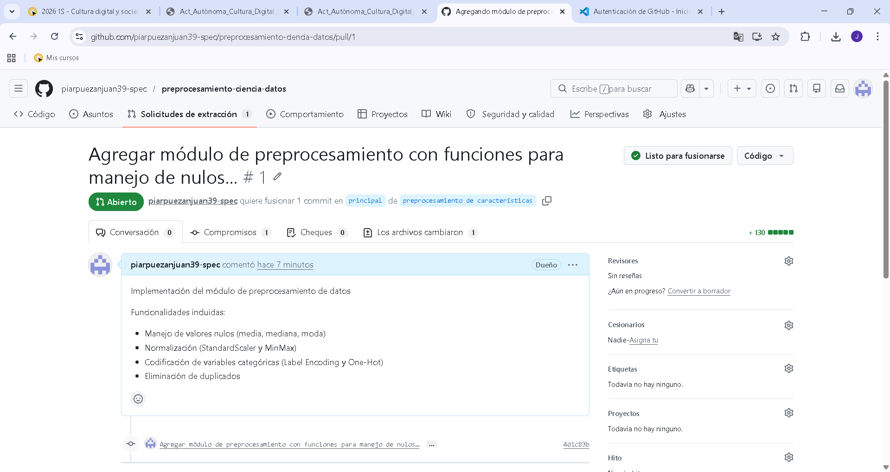
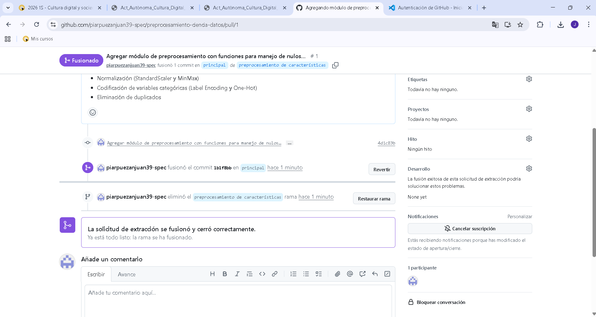

# Documentación del Proyecto - Preprocesamiento de Datos
# Nombre: Juan Piarpuezan
# curso: 3ro B
## 1. Introducción

### Objetivo del Proyecto
En el ecosistema actual de la Ciencia de Datos, la capacidad de gestionar código de manera colaborativa y garantizar la reproducibilidad de los análisis se ha convertido en un requisito fundamental. Los proyectos de datos modernos rara vez se desarrollan de forma aislada; exigen flujos de trabajo estructurados, control de versiones riguroso y metodologías que permitan la integración continua y la colaboración entre equipos multidisciplinarios. En este contexto, herramientas como Git y GitHub se han consolidado como estándares de la industria, facilitando el seguimiento de cambios, la gestión paralela de funcionalidades mediante ramas, y la revisión sistemática de código a través de pull requests. Estas prácticas no solo reducen la probabilidad de conflictos y errores, sino que también documentan de manera transparente la evolución del proyecto.

Paralelamente, la fase de preprocesamiento de datos representa uno de los pasos más críticos y demandantes dentro del ciclo de vida de cualquier iniciativa basada en datos. Estudios de la industria y la academia coinciden en que los profesionales destinan entre el 60% y el 80% de su tiempo a la limpieza, transformación y preparación de la información. La calidad de los datos de entrada determina directamente la fiabilidad de los modelos predictivos, la validez de los análisis estadísticos y la solidez de las decisiones derivadas. Problemáticas como valores nulos o inconsistentes, escalas dispares entre variables numéricas, atributos categóricos no estructurados y registros duplicados son inherentes a los conjuntos de datos reales y, si no se gestionan con técnicas adecuadas, introducen sesgos, degradan el rendimiento de los algoritmos y comprometen la integridad de los resultados.

Esta actividad integra de manera práctica ambas dimensiones: la ingeniería de software aplicada a la ciencia de datos y las técnicas fundamentales de manipulación de información. A través del uso de Git y GitHub, se establece un entorno de trabajo colaborativo que simula flujos profesionales de desarrollo, mientras que, mediante la biblioteca Pandas y módulos complementarios de scikit-learn, se implementa un pipeline completo de preprocesamiento. Este flujo de trabajo aborda sistemáticamente:
La gestión estratégica de valores faltantes mediante imputación por tendencia central o eliminación controlada.

La normalización y estandarización de características numéricas para garantizar comparabilidad y estabilidad algorítmica.

La codificación eficiente de variables categóricas (Label Encoding y One-Hot Encoding) para su compatibilidad con modelos matemáticos.

La detección y eliminación de registros duplicados que puedan distorsionar distribuciones o inflar métricas de evaluación.

El objetivo principal es demostrar cómo la combinación de un control de versiones eficiente y un preprocesamiento riguroso no solo optimiza el desarrollo de proyectos de datos, sino que también garantiza su escalabilidad, mantenibilidad y alineación con las mejores prácticas de la industria. Al finalizar esta actividad, se consolidan competencias técnicas y metodológicas que permiten abordar desafíos reales en Ciencia de Datos con un enfoque profesional, reproducible y orientado a la colaboración.
### Funcionalidades Implementadas
- Manejo de valores nulos (estrategias: mean, median, most_frequent)
- Normalización de variables numéricas (StandardScaler y MinMax)
- Codificación de variables categóricas (Label Encoding y One-Hot Encoding)
- Eliminación de registros duplicados

## 2. Comandos Git Utilizados

| Comando | Propósito |
|---------|-----------|
| `git init` | Inicializar repositorio local |
| `git clone [url]` | Clonar repositorio remoto |
| `git config --global user.name` | Configurar nombre de usuario |
| `git config --global user.email` | Configurar email |
| `git add .` | Agregar archivos al staging |
| `git commit -m "mensaje"` | Confirmar cambios |
| `git push origin [rama]` | Subir cambios a GitHub |
| `git checkout -b [rama]` | Crear y cambiar de rama |
| `git merge [rama]` | Fusionar ramas |

## 3. Automatización con GitHub Actions

### Workflow Implementado
Se configuró un workflow básico de CI/CD que se ejecuta automáticamente en cada push o pull request a la rama main.

## 4. Capturas de Pantalla

### 4.1 Comandos Ejecutados

### 4.2 Pull Request Creado

### 4.3 Fusión Completada

## 5. Conclusiones
El desarrollo de este proyecto ha permitido consolidar dos competencias críticas para el perfil profesional en Ciencia de Datos: la ingeniería de software aplicada a datos y la calidad analítica.
En primer lugar, la implementación práctica del módulo de preprocesamiento con Pandas y Scikit-learn evidenció que el estado de la materia prima (los datos) determina directamente la viabilidad de cualquier análisis o modelo posterior. Se comprobó que técnicas como la imputación estratégica de nulos, la estandarización de escalas y la codificación de variables no son pasos opcionales, sino requisitos fundamentales para evitar sesgos estadísticos y garantizar la convergencia de algoritmos de aprendizaje automático. La capacidad de estructurar este proceso en una clase reutilizable (PreprocesamientoDatos) demuestra la importancia de modularizar el código para facilitar su mantenimiento y escalabilidad.

En segundo lugar, la integración de Git y GitHub transformó la perspectiva sobre la gestión de proyectos. El uso de ramas (feature-preprocesamiento) y el flujo de Pull Requests demostró cómo se puede desarrollar funcionalidad de manera aislada sin comprometer la estabilidad de la rama principal. Esta metodología de trabajo no solo previene la pérdida de código, sino que establece un historial transparente y auditable de la evolución del proyecto, un estándar obligatorio en entornos laborales colaborativos.

Finalmente, la actividad confirma que el rol del científico de datos moderno requiere una mentalidad híbrida: debe poseer tanto la capacidad analítica para limpiar y transformar información compleja como las competencias técnicas para gestionar versiones, documentar procesos y automatizar despliegues. Las habilidades adquiridas en este laboratorio sientan las bases para operar bajo metodologías ágiles y participar eficazmente en equipos multidisciplinarios de alto rendimiento.

link del repositorio: https://github.com/piarpuezanjuan39-spec/preprocesamiento-ciencia-datos
